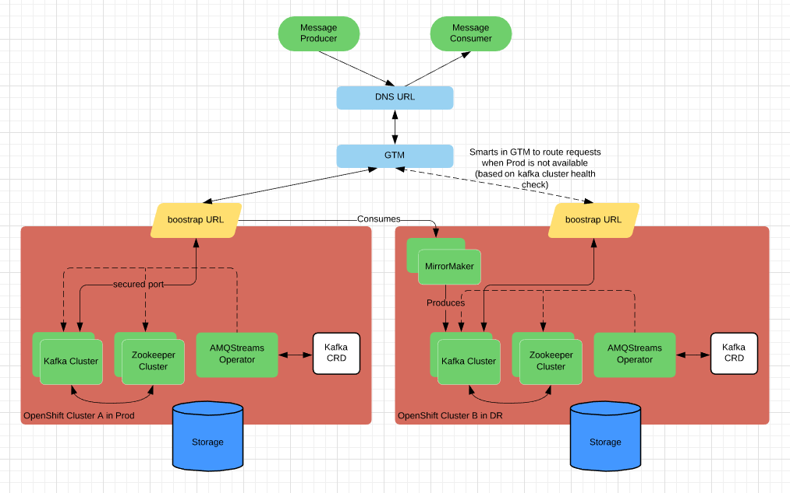

# AMQ Streams Multicluster Reference deployment

## Architecture

The architecture deployed by this template is shown in this diagram:



In this diagram two sites/data-centers are shown with a strimzi cluster operator and kafka cluster running within each site. These sites represent Production and Disaster Recovery(DR) environments. Kafka clients  produce and consume messages using an URL which is backed with Global Traffic Manager(GTM) a.k.a global load balancer. GTM will direct traffic to either Prod/DR clusters. An assumption here is, intelligence can be incorporated in GTM where it will redirect traffic to DR cluster only if Production kafka cluster healthcheck fails for configurable amount of time (say X seconds). When Production cluster becomes available, fail-back to Production needs to be planned and done during maintenance windows when clients are neither producing or consuming messages.  This is to minimize the message loss due to one-way MirrorMaker mirroring limitation.

Strimzi Cluster operator can be configured to watch the creation kafka crds i.e. Kafka, KafkaTopic, KafkaUser, KafkaMirrorMaker etc. objects in certain namespaces and create kafka and zookeeper clusters.      

MirrorMaker 1.0 which does one-way replication i.e. from Production to DR will run in DR cluster. It will consume messages from Production Cluster and produce to DR cluster. This is based on eventual consistency model. With this model, there is potential for messages produced and committed in Production cluster for not being available in DR when failed over to DR cluster.
 
*Note*: Since it is a TEST environment and lack of DNS server and GTM infrastructure availability, instructions outlined below does not deploy DNS URL and GTM. Clients will directly connect to kafka's bootstrap URL.

## Operator and Kafka Cluster Installation

Instructions below deploys two operators and two kafka and zookeper clusters in different namespaces simulating multiple clusters/environments. E.g. amq-operator-a, datacenter-a namespaces represent Production Cluster. Whereas, amq-operator-b, datacenter-b namespaces represent DR Cluster.

Get a [pull secret](https://access.redhat.com/terms-based-registry/#/accounts) for the registry.redhat.con and store it in a file called `pull-secret.base64`

In order to deploy execute the following steps

1. Set some environment variables:

    ```shell
    export PULL_SECRET=$(cat ./pull-secret.base64)
    ```
    
2. Clone this repository to your local computer and login to the OpenShift Cluster using a user who has ClusterAdmin access. ClusterAdmin is needed to install and create Kafka Custom Resource Definitions(CRDs).  

3. Deploy Kafka CRDs:

    ```shell
	oc apply -f crd/
    ```

4. Create ClusterRoles that are eventually assigned to Strimzi Operator ServiceAccounts

    ```shell
	oc apply -f clusterrole/
    ```
    
5. Create projects and deploy AMQStreams operator, kafka clusters. AMQStreams Operator deployed in amq-operator-a watches for Kafka CRDs in datacenter-a. Here, kafka cluster is created with own cluster certificates.

    ```shell
    oc new-project amq-operator-a
	oc new-project datacenter-a
	oc process -f templates/operator_template.yaml -p NAMESPACES_TO_WATCH=datacenter-a -p PULL_SECRET=$PULL_SECRET -p SERVICE_ACCOUNT_NAME=strimzi-cluster-operator| oc apply -f - -n amq-operator-a
	oc process -f templates/cluster_template.yaml -p OPERATOR_SERVICE_ACCOUNT_NAME=strimzi-cluster-operator -p AMQ_OPERATOR_NAMESPACE=amq-operator-a -p KAFKA_CLUSTER=my-cluster -p KAFKA_BROKER_SIZE=3 -p ZK_SIZE=3 | oc apply -f - -n datacenter-a
    ```
    
6. AMQStreams Operator in above step is created in **paused** state. So, resume the deployment
   
    ```shell
    oc rollout resume  deployment strimzi-cluster-operator -n amq-operator-a
    ```

7. Repeat above two steps where AMQStreams Operator deployed in amq-operator-b watches for Kafka CRDs in datacenter-b.

    ```shell
    oc new-project amq-operator-b
    oc new-project datacenter-b
    oc process -f templates/operator_template.yaml -p NAMESPACES_TO_WATCH=datacenter-b -p PULL_SECRET=$PULL_SECRET -p SERVICE_ACCOUNT_NAME=strimzi-cluster-operator| oc apply -f - -n amq-operator-b
    oc process -f templates/cluster_template.yaml -p OPERATOR_SERVICE_ACCOUNT_NAME=strimzi-cluster-operator -p AMQ_OPERATOR_NAMESPACE=amq-operator-b -p KAFKA_CLUSTER=my-second-cluster -p KAFKA_BROKER_SIZE=3 -p ZK_SIZE=3 | oc apply -f - -n datacenter-b
    oc rollout resume  deployment strimzi-cluster-operator -n amq-operator-b 
  	```
## MirrorMaker Installation
Instructions below deploys MirrorMaker in DR OpenShift cluster i.e. datacenter-b in our case. It consumes messages from source cluster topics and produces it to destination cluster.

Here are the steps

1. In our case, same certificates are used for source and destination clusters. So, extract the certificate from one of the kafka cluster namespaces i.e. datacenter-a or datacenter-b

    ```shell
	oc extract secret/my-cluster-cluster-ca-cert -n datacenter-a --keys=ca.crt --to=- > ca.crt
    ```
2. MirrorMaker communicates with two clusters. So, create two secrets that houses certificates i.e. producer-secret and consumer-secret. Even though it is same certificate for both clusters, KafkaMirrorMaker needs them to be defined as two different secrets

	```shell
    oc create secret generic producer-secret --from-file=ca.crt
    oc create secret generic consumer-secret --from-file=ca.crt
    ```
3. MirrorMaker has to authenticate while communicating with clusters. So, create two secrets that contains password i.e. producer-password and consumer-password. Even though it is same credentials for both clusters, KafkaMirrorMaker needs them to be defined as two different secrets

	```shell
    oc create secret generic producer-password --from-literal=password=gUoNKbFYIPV5
    oc create secret generic consumer-password --from-literal=password=gUoNKbFYIPV5
    ```
4. Deploy the MirrorMaker using template

	```shell
    export BROKER_URL=`oc get routes my-cluster-kafka-bootstrap -n datacenter-a -o=jsonpath='{.status.ingress[0].host}{"\n"}'`
    
    oc process -f templates/mirrormaker_template.yaml -p SOURCE_BOOTSTRAP_URL=$BROKER_URL \
    -p DESTINATION_BOOTSTRAP_SVC=my-second-cluster-kafka-bootstrap \
    -p CONSUMER_TLS_SECRET=consumer-secret -p CONSUMER_CERT_FILENAME=ca.crt \
    -p CONSUMER_USERNAME=my-user -p CONSUMER_PASSWORD_SECRET=consumer-password \
    -p CONSUMER_PASSWORD_KEY=password -p PRODUCER_TLS_SECRET=producer-secret \
    -p PRODUCER_CERT_FILENAME=ca.crt -p PRODUCER_USERNAME=my-user \
    -p PRODUCER_PASSWORD_SECRET=producer-password \
    -p PRODUCER_PASSWORD_KEY=password | oc apply -f - -n datacenter-b
    ```
## Verification

Once operators and clusters are deployed, here are the steps to produce and consume messages to kafka cluster using **kafka console utilities**. Please make sure that java with atleast version 8 is installed. Kafka utilities need java.

1. Download the kafka zip file that has utilities from [here](https://access.redhat.com/jbossnetwork/restricted/softwareDownload.html?softwareId=70471) and unzip the file to say `kafka-util` folder.

2. Extract the certificate from one of the kafka cluster namespaces i.e. datacenter-a or datacenter-b

	```shell
	oc extract secret/my-cluster-cluster-ca-cert -n datacenter-a --keys=ca.crt --to=- > ca.crt
	```

3. Create a java key store file for kafka utilities

	```shell
	keytool -keystore kafka.client.truststore.jks -alias CARoot -import -file ca.crt -storepass test1234 -noprompt
	```

4. Create a kafka config file say `client-sasl-scram.properties` with the following contents that needs to be passed in while running kafka utilities. Change username and password accordingly if the parameters  passed in for kafka user and kafka user password is different from what the below example uses

	```properties
 	security.protocol=SASL_SSL
	ssl.truststore.location=kafka.client.truststore.jks
	ssl.truststore.password=test1234
	ssl.endpoint.identification.algorithm=HTTPS

	sasl.mechanism=SCRAM-SHA-512
	sasl.jaas.config=org.apache.kafka.common.security.scram.ScramLoginModule required \
          username="my-user" \
          password="gUoNKbFYIPV5";
	```
	
5. Run a consumer in a terminal window

	```shell
	export BROKER_URL=`oc get routes my-cluster-kafka-bootstrap -n datacenter-a -o=jsonpath='{.status.ingress[0].host}{"\n"}'`
	export KAFKA_HOME=kafka-util
	$KAFKA_HOME/bin/kafka-console-consumer.sh --bootstrap-server $BROKER_URL:443 --topic my-topic --consumer.config client-sasl-scram.properties
	```
	
6. Run a producer in a different terminal window

	```shell
	export BROKER_URL=`oc get routes my-cluster-kafka-bootstrap -n datacenter-a -o=jsonpath='{.status.ingress[0].host}{"\n"}'`
	export KAFKA_HOME=kafka-util
	$KAFKA_HOME/bin/kafka-console-producer.sh --broker-list $BROKER_URL:443 --topic my-topic --producer.config client-sasl-scram.properties
	```
	
7. At producer window, type the messages and see that they are consumed by consumer

8. Run consumer and producer against kafka cluster in datacenter-b by changing the bootstrap url

## MirrorMaker Verification

We are going to use the same kafka console utilities and `client-sasl-scram.properties` to test MirrorMaker replication. Messages are produced in source cluster and see that they are consumed in source cluster, replicated in destination cluster and consumed from there

1. Run a consumer consuming messages from source cluster i.e. datacenter-a in a terminal window

	```shell
	export BROKER_URL=`oc get routes my-cluster-kafka-bootstrap -n datacenter-a -o=jsonpath='{.status.ingress[0].host}{"\n"}'`
	export KAFKA_HOME=kafka-util
	$KAFKA_HOME/bin/kafka-console-consumer.sh --bootstrap-server $BROKER_URL:443 --topic my-topic --consumer.config client-sasl-scram.properties
	```
2. Run another consumer consuming messages from destination cluster i.e. datacenter-b in a terminal window

	```shell
	export BROKER_URL=`oc get routes my-second-cluster-kafka-bootstrap -n datacenter-b -o=jsonpath='{.status.ingress[0].host}{"\n"}'`
	export KAFKA_HOME=kafka-util
	$KAFKA_HOME/bin/kafka-console-consumer.sh --bootstrap-server $BROKER_URL:443 --topic my-topic --consumer.config client-sasl-scram.properties
	```
3. Run a producer producing messages to source cluster i.e. datacenter-a in a terminal window

	```shell
	export BROKER_URL=`oc get routes my-cluster-kafka-bootstrap -n datacenter-a -o=jsonpath='{.status.ingress[0].host}{"\n"}'`
	export KAFKA_HOME=kafka-util
	$KAFKA_HOME/bin/kafka-console-producer.sh --broker-list $BROKER_URL:443 --topic my-topic --producer.config client-sasl-scram.properties
	```
4. At producer window, type the messages and see that they are consumed by two consumers i.e. one is listening to a topic in source cluster and the other is to the destination cluster.

5. Run consumer and producer against kafka cluster in datacenter-b by changing the bootstrap url

## Performance Testing

Kafka Broker

```yaml
  replicas: 3
  resources:
    limits:
      cpu: 750m
      memory: 2Gi
```

Zookeeper

```yaml
  replicas: 3
  resources:
    limits:
      cpu: 500m
      memory: 2Gi
```

MirrorMaker

```yaml
  replicas: 3
  resources:
    limits:
      cpu: 500m
      memory: 2Gi
```

Producer command:

```shell

$KAFKA_HOME/bin/kafka-producer-perf-test.sh --topic my-topic \
--num-records 10000 \
--record-size 4096 \
--throughput 100000 \
--producer.config client-sasl-scram.properties \
--producer-props \
acks=1 \
bootstrap.servers=$BROKER_URL:443 \
buffer.memory=67108864 \
compression.type=none \
batch.size=8196
```
MirrorMaker lag monitoring:

```
watch '$KAFKA_HOME/bin/kafka-consumer-groups.sh --bootstrap-server $BROKER_URL:443 --command-config client-sasl-scram.properties --group my-mirrormaker-group-id --describe'
```

Producer test results:

| Broker Replicas | Replica Mem Limit | Message Size       | Message Rate | Throughput | Avg Latency | Max MirrorMaker Lag |
| --------------- | ----------------- | ------------------ | ------------ | ---------- | ----------- | ------------------- |
| 3               | 2 Gi              | 10  KiB (10240B)   | 100 msg/s    | 1.0 MB/s   | 3  ms       |  2000 records       |
| 3               | 2 Gi              | 100 KiB (102400B)  | 10  msg/s    | 1.0 MB/s   | 30 ms       |  200  records       |
| 3               | 2 Gi              | 1   MiB (1048000B) | 1   msg/s    | 1.0 MB/s   | 30 ms       |  20   records       |


Conclusions:

Given a small cluster (see limits above) and a producer throughput of 1 MB/s, we can keep `datacenter-b` generally less than 20 seconds 
behind `datacenter-a`. This may or may not be within a organization's SLAs.

To enable large messages, these two values need to match: `KafkaMirrorMaker.spec.producer.config.max.request.size`
 and `Kafka.spec.kafka.config.message.max.bytes`

Consider setting `Kafka.spec.kafka.config.log.retention.bytes` to less than the size of the Persistent Volume Claim to avoid running out of disk.


Latency test:

```shell
$KAFKA_HOME/bin/kafka-run-class.sh kafka.tools.EndToEndLatency $BROKER_URL:443 my-topic 1000 all 4096 client-sasl-scram.properties
```


